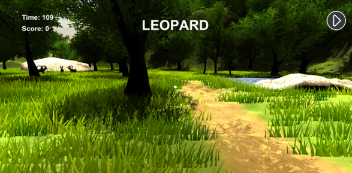

# MEET ANIMALS🐏🐂🐕
> Educational game for toddlers that user can see animals and learn about them in english

### Target Users
  - Any toddlers who want to learn English words
  
### Goal
  - Users can naturally learn English words of animals
  - By answering quiz, users can review what they learned

### Domain & Platform
  - VR & Google Cardboard
  
### Main Feature
  - The application consists of two stages
  - The Background is a Zoo and Farm
  - Stage1 : Learning English words
  - Stage2 : Quiz

## Overview

  

## Detail

### Main Menu

  

### Select Stage/Mode

  

### [Stage1] Learning
  - User can walk around the zoo and farm
  
   

  
  - Touch and animal, the word is shown and user hears the animal's crying
  - Each background has different animals

   

### [Stage2] Quiz
  - Shows the word
  - User walks through the zoo and find the animal that matches the word
  
   

  
  - User Find the animal and click the button
  - If the answer is correct, user will hear the animal's crying and O mark appears
  - If the answer is wrong, X mark appears
  
   

  
### Pause&Settings
  - When the user looks down, pasue menu appears
  - During pause
    - player can't navigate the scene
    - time stops in Quiz stage
  - Setting
    - user can change volume of music and sound effects
  
  

  

## The Role and Contribution
  
  

